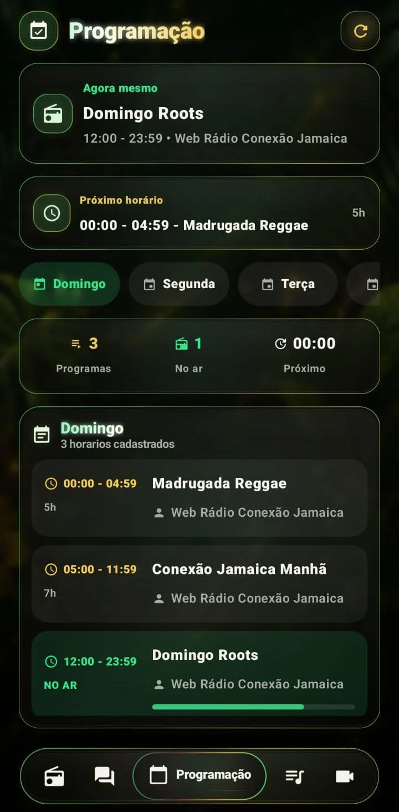
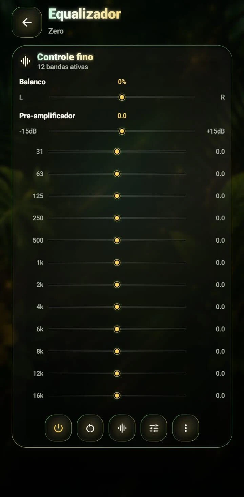
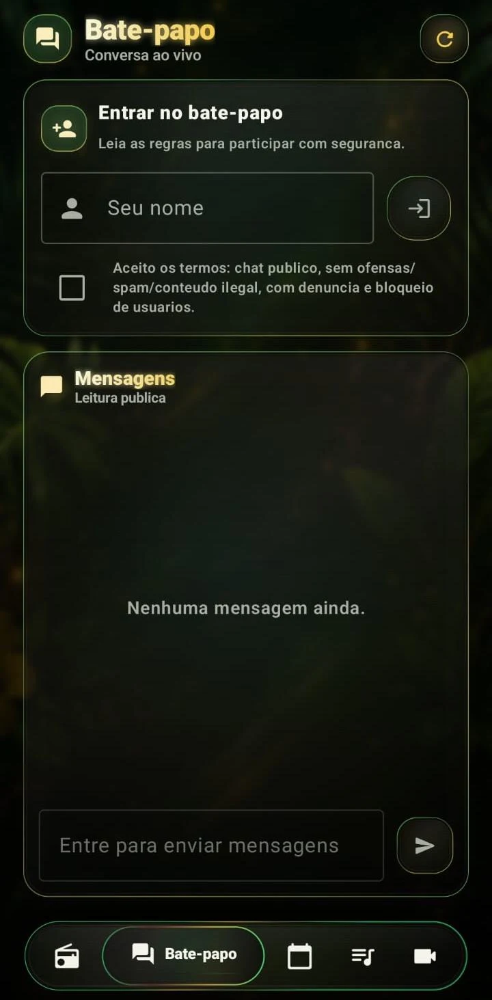
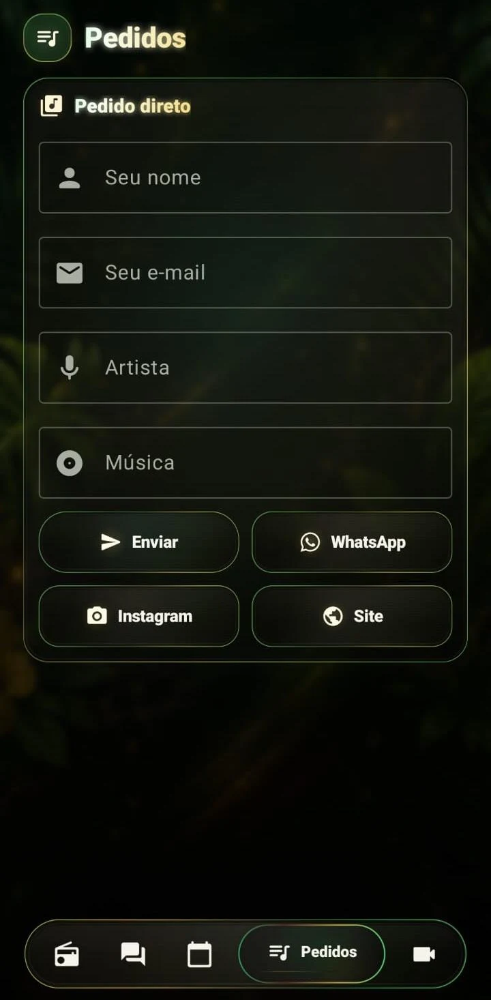
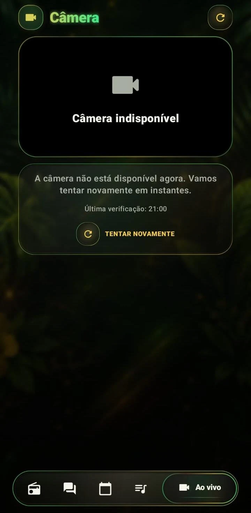
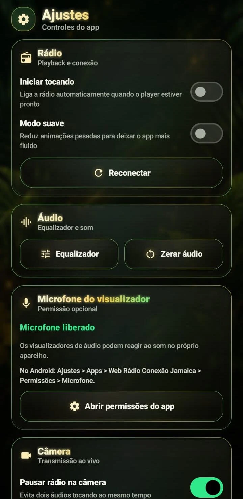
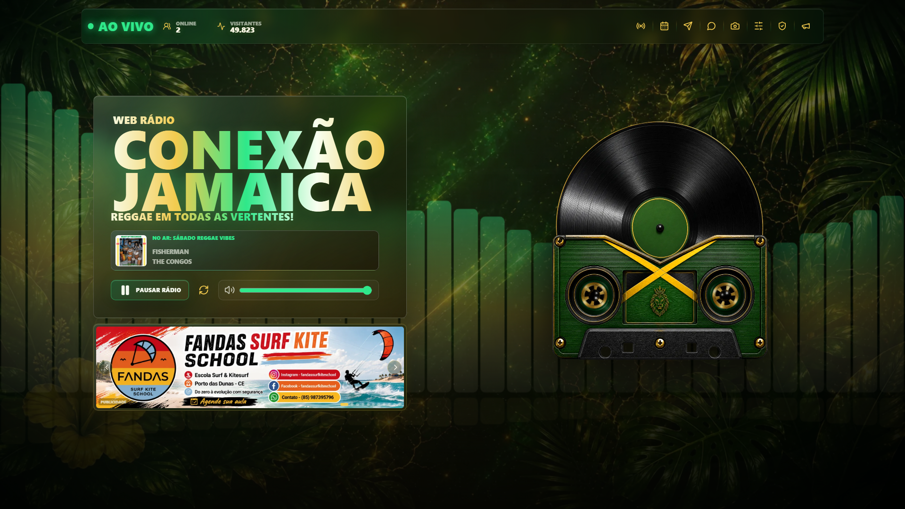
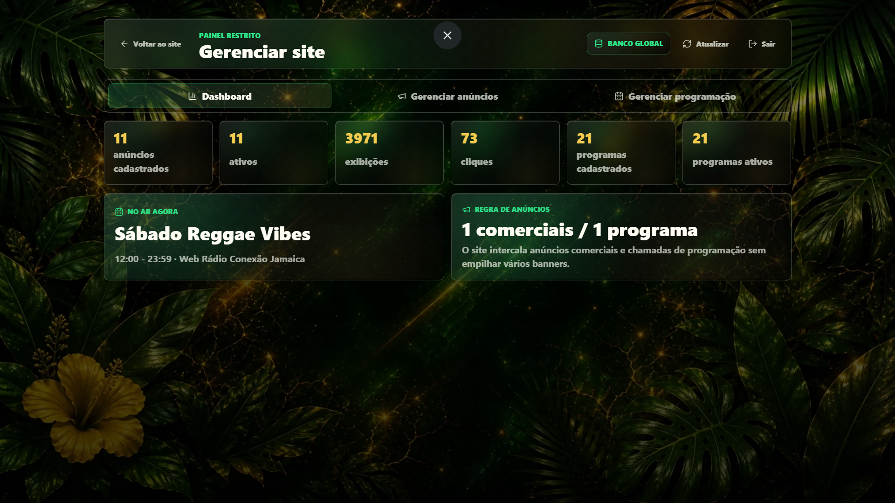

# Web Rádio Conexão Jamaica

Plataforma digital completa para rádio online, com aplicativo Android publicado, site responsivo, player ao vivo, programação, chat, pedidos musicais, câmera, publicidade direta e painel administrativo.

Este repositório é uma versão pública segura do projeto. Ele preserva a identidade, a experiência visual e a arquitetura técnica, mas remove credenciais, chaves de assinatura, endpoints privados, tokens, regras operacionais internas e dados sensíveis de produção.

## Links Oficiais

- Site: [webradioconexaojamaica.com](https://webradioconexaojamaica.com/)
- App Android na Play Store: [Web Rádio Conexão Jamaica](https://play.google.com/store/apps/details?id=com.web.radio.conexaojamaica.app)

## Produto

Web Rádio Conexão Jamaica é uma experiência de streaming musical pensada para entregar presença de marca, estabilidade de reprodução e uma interface visual forte. O projeto combina aplicativo nativo Android, site público e ferramentas administrativas para operação de conteúdo, campanhas e programação.

O foco do produto é claro: rádio online com identidade própria, performance mobile, controles de áudio, integração com conteúdo ao vivo e uma camada visual marcante inspirada no universo reggae, vinil, tape deck e glass UI.

## Destaques

- Aplicativo Android nativo com experiência visual premium em Jetpack Compose.
- Site responsivo com player ao vivo, navegação rápida e presença visual de marca.
- Player com suporte a reprodução em segundo plano e estado de transmissão.
- Programação estruturada por dias, horários, programa atual e próximo horário.
- Bate-papo ao vivo com aceite de termos, regras de uso e superfície de moderação.
- Pedidos musicais com formulário direto e atalhos externos.
- Tela de câmera ao vivo com tratamento de indisponibilidade.
- Equalizador com controle fino e base para efeitos de áudio.
- Visualizador de áudio com permissão opcional de microfone.
- Publicidade direta com banners e rotação planejada.
- Painel administrativo para anúncios, programação e métricas operacionais.
- Política de privacidade e decisões de segurança documentadas.

## Experiência Visual

<p align="center">
  
</p>

### Aplicativo Android

<table>
  <tr>
    <td width="33%"></td>
    <td width="33%"></td>
    <td width="33%"></td>
  </tr>
  <tr>
    <td align="center"><strong>Player ao vivo</strong></td>
    <td align="center"><strong>Programação</strong></td>
    <td align="center"><strong>Equalizador</strong></td>
  </tr>
  <tr>
    <td width="33%"></td>
    <td width="33%"></td>
    <td width="33%"></td>
  </tr>
  <tr>
    <td align="center"><strong>Bate-papo</strong></td>
    <td align="center"><strong>Pedidos</strong></td>
    <td align="center"><strong>Câmera</strong></td>
  </tr>
  <tr>
    <td width="33%"></td>
    <td width="33%"></td>
    <td width="33%"></td>
  </tr>
  <tr>
    <td align="center"><strong>Ajustes</strong></td>
    <td></td>
    <td></td>
  </tr>
</table>

### Site e Painel

<p align="center">
  
</p>

<p align="center">
  
</p>

## Aplicativo Android

O app foi desenhado para ser mais do que um player simples. A interface concentra transmissão, metadados da música, anúncios, atalhos, navegação inferior, visualizador e controle de reprodução em uma experiência mobile com identidade própria.

Principais áreas:

- Home com player, status ao vivo, música atual, anúncio e navegação principal.
- Serviço de reprodução preparado para mídia em segundo plano.
- Controle de estado para conexão, buffering, play/pause e reconexão.
- Equalizador com preamp, balanço e bandas de frequência.
- Visualizador de áudio com uso local de microfone, sem envio de áudio para servidor.
- Programação com destaque para o programa atual e próximo bloco.
- Chat com fluxo de entrada, aceite de regras e leitura pública.
- Pedidos musicais com validação de formulário.
- Câmera ao vivo com fallback para indisponibilidade.
- Ajustes locais para desempenho, permissões e comportamento do player.

## Site

O site amplia a presença digital da rádio com player web, identidade visual consistente e integrações preparadas para conteúdo dinâmico.

Principais áreas:

- Player web com status ao vivo.
- Interface responsiva com foco em impacto visual.
- Seção de anúncios com banners diretos.
- API serverless para dados públicos.
- Estados seguros para falha de serviços externos.
- Estrutura para programação e dados da música no ar.
- Painel restrito para gerenciamento de anúncios e programação.

## Painel Administrativo

O painel foi projetado para apoiar operação real do site sem depender de edição manual de código.

Recursos modelados:

- Dashboard com visão geral de anúncios e programação.
- Cadastro, ativação e ordenação de banners.
- Organização de chamadas comerciais e chamadas de programa.
- Controle de programação por dia e horário.
- Upload de imagens por fluxo administrativo.
- Métricas de exibição e cliques.
- Separação entre dados públicos e operações restritas.

## Arquitetura Técnica

O projeto separa camadas para manter clareza, testabilidade e evolução:

- UI declarativa no app com Compose.
- Estado de tela separado da camada visual.
- Interfaces de dados para player, programação, chat, anúncios e políticas.
- Camada web com componentes reutilizáveis e clientes de API tipados.
- Funções serverless para APIs públicas e painel administrativo.
- Schema de banco isolado para anúncios e programação.
- Configurações sensíveis fora do código público.

## Stack

Android:

- Kotlin
- Jetpack Compose
- Material 3
- AndroidX Lifecycle
- Media3 / ExoPlayer
- MediaSession
- OkHttp
- Gson
- Jsoup
- Coil
- JUnit

Web:

- React
- TypeScript
- Vite
- React Router
- TanStack Query
- HLS.js
- Lucide React
- Netlify Functions
- Netlify Database
- Netlify Blobs
- Drizzle ORM

## Segurança e Privacidade

Esta versão pública foi preparada para demonstrar o projeto sem expor o que poderia prejudicar a rádio.

Não estão incluídos:

- chave de assinatura Android
- senhas, hashes reais, tokens ou credenciais administrativas
- endpoints privados de streaming, chat, câmera ou pedidos
- IDs internos de provedores
- variáveis reais de banco, storage ou deploy
- regras internas de operação
- dados privados de campanhas, logs ou moderação

O app também modela decisões importantes de privacidade, como backup local desativado para dados sensíveis e uso de microfone somente para visualização local de áudio.

## Estrutura

```text
app/                         Esqueleto público do app Android
site/                        Esqueleto público do site React/Vite
site/netlify/functions/      API serverless demonstrativa
site/db/                     Schema público de dados
docs/images/                 Galeria visual do produto
.env.example                 Modelo de variáveis de ambiente
keystore.properties.example  Modelo de assinatura Android
PUBLICATION_CHECKLIST.md     Checklist do que pode ou não ir público
SECURITY.md                  Notas de segurança do repositório
```

## Como Rodar o Site

```bash
cd site
pnpm install
pnpm dev
```

A API serverless incluída retorna dados demonstrativos. O objetivo é permitir avaliação do fluxo sem expor infraestrutura real.

## Como Rodar o App

```bash
./gradlew :app:assembleDebug
```

Para builds reais, use um `keystore.properties` local ou secrets de CI. Nunca publique chaves, senhas ou arquivos `.jks`.

## Por Que Este Projeto É Relevante

Este projeto demonstra capacidade de entregar produto completo, não apenas telas isoladas. Ele cobre interface nativa, experiência web, mídia ao vivo, estado assíncrono, APIs, painel administrativo, privacidade, deploy e documentação pública segura.

Para empresas, o valor está na combinação de:

- entrega visual com identidade forte
- arquitetura de app e site trabalhando em conjunto
- preocupação real com segurança e publicação pública
- organização para evolução de produto
- experiência final publicada e acessível ao público

## Status Público

- Produto real online: [webradioconexaojamaica.com](https://webradioconexaojamaica.com/)
- App publicado: [Google Play Store](https://play.google.com/store/apps/details?id=com.web.radio.conexaojamaica.app)
- Repositório atual: vitrine pública segura, sem segredos de produção

## Nota

Este repositório não é o código completo de produção. Ele é uma apresentação técnica e visual do projeto, preparada para GitHub público, portfólio, avaliação profissional e conversas com empresas sem comprometer a operação da Web Rádio Conexão Jamaica.
